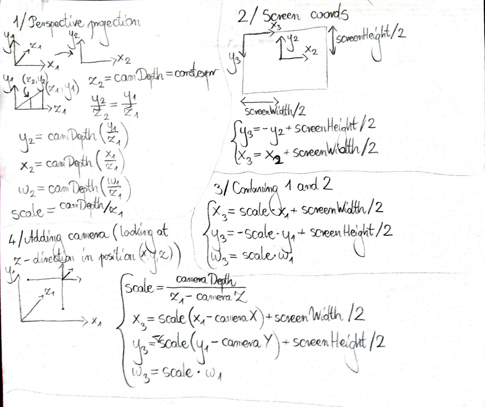

# Outrun

The game data (the road coordinates) are defined in terms of a 3D coordinate system. The world is rendered using a couple of transformations, which are described below:



Below some of the most crucial parts of the code are explained.

```cpp
bool Project(const Vector3f &cameraCoords)
{ // Perspective projection
if(z-cameraCoords.z<=0.f) return false; // Invalid projection, skipping

float scale = cameraDepth/(z-cameraCoords.z);
projectedLine.x = scale*(x-cameraCoords.x) + hScreenWidth;
projectedLine.y = -scale*(y-cameraCoords.y) + hScreenHeight;
projectedLine.length = scale*lineLength;

return true;
}
```

`z-cameraCoords.z<=0.f` means, that something is behind the camera (and thus the projection is for sure invalid).

```cpp
void drawSpriteOnTheRight(sf::RenderWindow& window, sf::Sprite& sprite, const HorizontalLineProjection& fl1)
{
  HorizontalLine projectedLine = fl1.projectedLine;
  sf::IntRect textureRect = sprite.getTextureRect();
  float scale = projectedLine.length/((float)textureRect.width);
  sprite.setScale(scale, scale);
  sprite.setPosition({projectedLine.x+projectedLine.length, projectedLine.y-sprite.getGlobalBounds().height});
  window.draw(sprite);
}
```

Having rendered the road, one can render the sprites according to this road and scale the sprites accordingly.

```cpp
float percentOfSegmentBeaten = (cameraCoords.z-beatenSegment*segmentLength)/segmentLength;
cameraCoords.y = 100.f + roadCoords[beatenSegment].y +
percentOfSegmentBeaten*(roadCoords[beatenSegment+1].y-roadCoords[beatenSegment].y); 
```

When there is an elevation, the position (height) of the camera is adjusted accordingly to its position above the segment (linear interpolation).


```cpp
for(int i=99; i>=0; i--) // Further things should be rendered earlier
{ // Road rendering
    int currentSegment = beatenSegment + i;
    if(currentSegment+1>=roadCoordsSize)
    { std::cout << "The Game Was Beaten" << std::endl; delete roadCoords; return 0; }
    
    float x0=roadCoords[currentSegment].x,
    y0=roadCoords[currentSegment].y,
    z0=roadCoords[currentSegment].z,
    x1=roadCoords[currentSegment+1].x,
    y1=roadCoords[currentSegment+1].y,
    z1=roadCoords[currentSegment+1].z;

    HorizontalLineProjection fl1(x0,y0,z0,segmentFullWidth), fl2(x1,y1,z1,segmentFullWidth),
    l1(x0,y0,z0,segmentWidth), l2(x1,y1,z1,segmentWidth);
    if(fl1.Project(cameraCoords) && fl2.Project(cameraCoords)
    && l1.Project(cameraCoords) && l2.Project(cameraCoords))
    { // If valid projection, draw road segment with its surrounding grass
    drawTrapeze(window, (currentSegment)%2 ? darkGrassColor : lightGrassColor, // Grass rendering
        {hScreenWidth, l1.projectedLine.y, screenWidth},
        {hScreenWidth, l2.projectedLine.y, screenWidth});

    // Grub rendering
    drawTrapeze(window, (currentSegment)%2 ? blackColor : whiteColor, fl1.projectedLine, fl2.projectedLine);

    // Road rendering
    drawTrapeze(window, (currentSegment)%2 ? darkGrubColor : lightGrubColor, l1.projectedLine, l2.projectedLine);

    // Sprites rendering
    if(!(currentSegment%5))
        drawSpriteOnTheRight(window, spriteTree, fl1);
    }
}
```

- Road is rendered from back to front (Z-buffering).
- Sprites are rendered on top of Road which is rendered on top of Grub which is rendered on top of Grass.