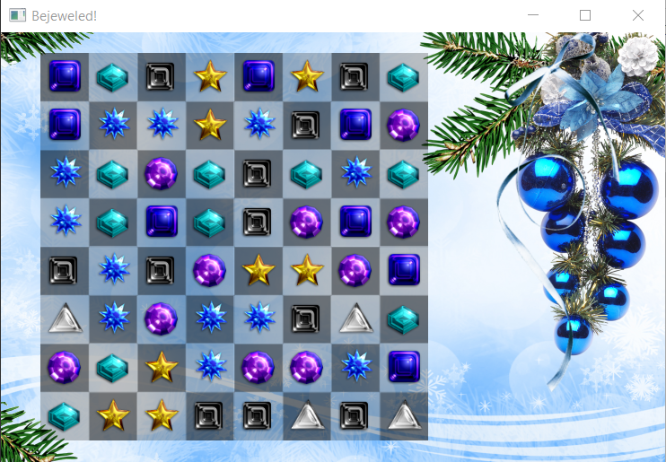

# Bejeweled

## Definition of the program objective:
- Displays backgrounds and gems on the screen.
- Possibility to change the places of two adjacent vertically or horizontally gems. Replacing these gems should only be accepted if three gems of the same type (horizontal or vertical) have been created. Changing places of gems should be accompanied by their moving animation.
- When at least three gems (horizontal or vertical) are created, then at least three gems should be marked for removal.
- Gems to be removed are removed in the animation by decreasing their alpha, then they are replaced by gems falling from above (animation). In the event that at least three gems are created in this step, the removal of gems should be repeated.

## Specification of the program:
- Data structure holding gem data. This data structure holds:
  - in the form of a two-dimensional array, the game grid, in which each square stores:
  - a gem characterized by type and location
- Gems will only be displayed on the screen depending on the structure described above.
- Function to check and mark the existence of gems to be removed. The gems to be removed are marked in a separate logic board. The function returns a char indicating the existence of gems to be removed.
- A function that changes the places of two vertically or horizontally adjacent jewels. An animation is triggered during this process. Changing places is only accepted if three jewels of the same type (horizontal or vertical) have been created. If the change of places is accepted, the jewel removal function is called.
- Function to remove gems marked as to be removed. During this process, an animation of removing gems by reducing their alpha is triggered, and then they are replaced by gems falling from above (animation). In the event that at least three gems are created in this step, the removal of gems should be repeated.

## The game loop cycle would be as follows:
- events (closing the window and clicking gems on the screen). If the gems on the screen are clicked correctly, the corresponding functions are called.
- default game rendering.
